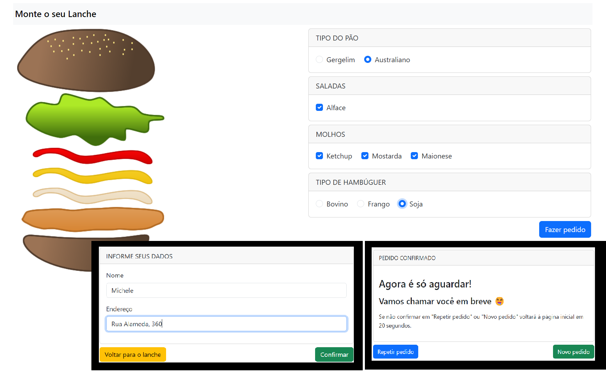

<h1 align="center">Montando o lanche</h1>

Este é um projeto desenvolvido no curso Desenvolvimento Web Avançado com Vue (v2 e v3) e Vuex, da Udemy.

  <a href="#-tecnologias">Tecnologias</a>&nbsp;&nbsp;&nbsp;|&nbsp;&nbsp;&nbsp;
  <a href="#-layout">Layout</a>

  

 

## 🚀 Tecnologias

Esse projeto foi desenvolvido com as seguintes tecnologias:

- HTML
- JavaScript
- VueJS
- Bootstrap
- Git e Github

## 💻 Projeto

Montando o Lanche é uma aplicação web interativa que simula o site de uma lanchonete, permitindo aos usuários personalizar e montar seus lanches conforme suas preferências. Com uma interface amigável e intuitiva, os usuários podem adicionar ingredientes, inserir seus dados pessoais (nome e endereço) e confirmar seu pedido.

 Feito com ♥

